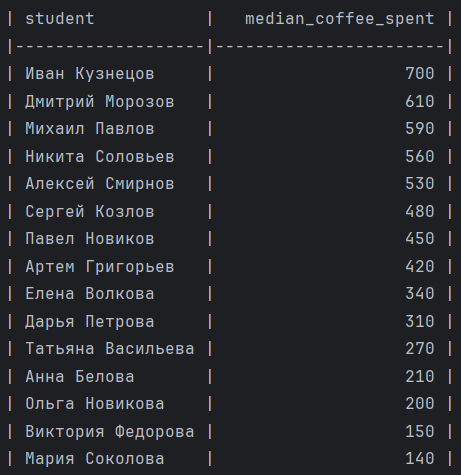

## Установка

```bash
git clone https://github.com/Zhastik/Workmate
cd Workmate
pip install pytest tabulate
````

## Запуск

```bash
python main.py --files <файл1.csv> <файл2.csv> --report <название_отчета>
```

### Пример запуска из корневой директории

```bash
python main.py --files math.csv physics.csv programming.csv --report median-coffee
```

### Запуск тестов

```bash
pytest -v
```

## Пример результата



````
